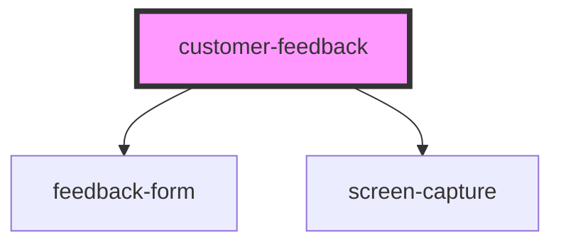

# customer-feedback

<!-- Auto Generated Below -->

## Properties

| Property | Attribute | Description | Type     | Default     |
| -------- | --------- | ----------- | -------- | ----------- |
| `header` | `header`  |             | `string` | `undefined` |
| `intro`  | `intro`   |             | `string` | `undefined` |

## Methods

### `close() => Promise<void>`

#### Returns

Type: `Promise<void>`

### `show() => Promise<void>`

#### Returns

Type: `Promise<void>`

## Dependencies

### Depends on

- [feedback-form](../feedback-form)
- [screen-capture](../screen-capture)

### Graph

---

_Built with [StencilJS](https://stenciljs.com/)_
