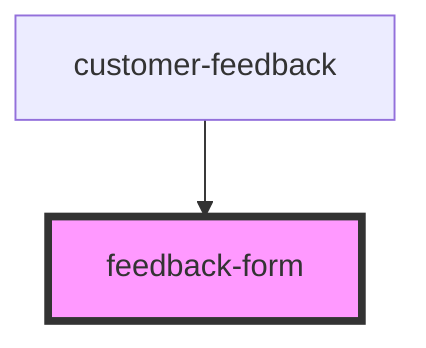

# feedback-form

<!-- Auto Generated Below -->

## Properties

| Property | Attribute | Description | Type     | Default                                                      |
| -------- | --------- | ----------- | -------- | ------------------------------------------------------------ |
| `header` | `header`  |             | `string` | `'Send feedback'`                                            |
| `intro`  | `intro`   |             | `string` | `"Use this form to report any problems you've encountered."` |

## Events

| Event      | Description | Type               |
| ---------- | ----------- | ------------------ |
| `feedback` |             | `CustomEvent<any>` |

## Dependencies

### Used by

- [customer-feedback](../customer-feedback)

### Graph

---

_Built with [StencilJS](https://stenciljs.com/)_
