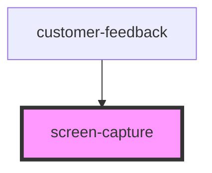

# screen-capture

<!-- Auto Generated Below -->

## Methods

### `initialise() => Promise<void>`

#### Returns

Type: `Promise<void>`

## Dependencies

### Used by

- [customer-feedback](../customer-feedback)

### Graph

---

_Built with [StencilJS](https://stenciljs.com/)_
